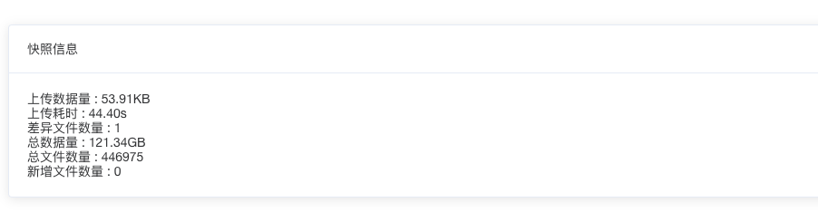
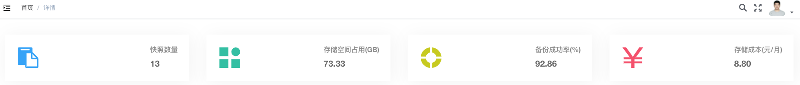
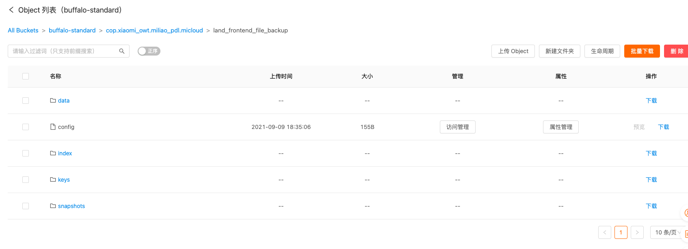
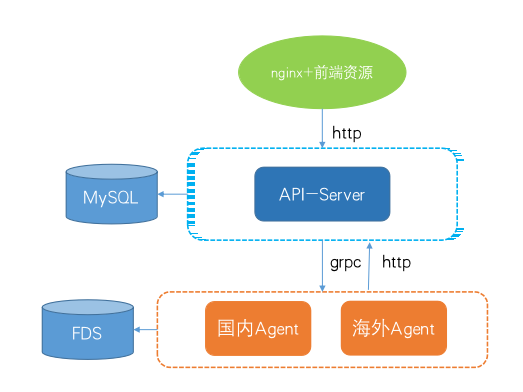

# 新版备份系统介绍和使用分享


## 目录

1. 系统介绍 <!-- 新版备份系统面向SRE工程师用户开发, 能够让用户方便地备份业务重要数据文件, 包括不限于数据库文件, 配置文件, 日志文件等 -->
2. 特性和架构介绍  <!-- 特性(优点) 提供了快捷, 高速, 低成本, 可靠 , 快照的概念 & 系统组件 -->
3. 接入流程演示


## 新版系统介绍

面向SRE工程师用户开发, 能够让用户方便地**备份**并**恢复**业务重要**数据文件** <!-- 包括不限于数据库文件, 配置文件, 日志文件等, 原始日志做留存复现, 线上数据库冷备, 网站的静态资源 -->

```yaml [1|2]
staing环境: http://buffalo.micloud.srv
线上环境: https://buffalo.pt.xiaomi.com
```

Note: 为什么说面向SRE工程师开发? 备份和恢复是对线上环境做操作, 一方面目前为了保障线上环境文件可以正常读取到, 备份程序以root 身份运行, 需要SRE权限进行操作, 另一方面数据备份过程会占用了线上环境的磁盘io, 网卡, cpu性能, 不加限制可能会影响线上环境, 出于两方面的考虑, 所以当前仅开放对SRE进行管理....  为什么强调数据文件? 新版备份系统面向数据文件进行备份, (是冷备) 对某一时刻的文件内容, 目录, 状态打快照, 并可以恢复至快照当时的状态 , 大家伙也可以在融合云找到 融合云主页 -> 产品 -> SRE/运维工具 -> 备份系统, 或者直接在搜索框搜索 buffalo


## 特性介绍

* 快捷
* 高速
* 低成本
* 可靠


## 便捷👋

1. 使用golang完全重构, 安装维护成本极大减少
2. 集成定时任务 <!-- 不需要再到主机上编辑定时任务 -->
3. 支持目录备份 <!-- 不需要备份前先归档目录 -->
4. 支持web管理 <!-- 创建, 修改任务,  查看备份进度, 快照大小, 存储成本, 发起备份和恢复 -->

```bash
            安装包大小   依赖                 多线程并发   限速
旧版agent	1.1G        JRE|ruby|S3|HDFS	不支持      不支持
新版agent	27M         无	                支持        支持
```
Note: 


## 高效⚡️

1. 充分利用服务器多核能力, 提升备份和恢复速度 <!-- 调度多核心进行目录扫描, 多线程打包成专用格式并多线程上传到FDS -->
2. 支持增量备份, 每次备份仅上传差异文件, 加快备份速度 <!-- 每个文件都进行 sha256, 确保不会重复上传   -->

```
http://buffalo.micloud.srv/#/restore/7
```



Note: path --> tree/file --> tree/file blob (<1MB) --> index/data packs (<8MB>) + snapshot  一些性能数据: 千兆网卡轻松跑满, 信息SRE 在科技园机房有一些几十TB的备份任务, 网卡能跑到3.5Gpbs 400+MB/s


## 低成本💰

1. 增量备份, 相同文件仅存储一份, 减少存储成本
2. FDS-我米自建存储, 相比其他公有云有带宽, 延时优势

```
http://buffalo.micloud.srv/#/detail/7
```



Note: 流量费用, 第三方公有云的抽成, 目前申请了10TB的bucket存储空间, 我们可以先用着, 不够了再申请 | sha256 确保每个文件只上传一次


## 可靠✊

1. 数据可靠性  <!-- [数据来源](http://docs.api.xiaomi.net/fds/pricing.html) -->
```
对比指标  FDS标准存储类型  FDS低频存储类型
数据可靠性  99.999999999%  99.999999999%
```

2. 安全措施
   1. FDS密钥管理
   2. 数据加密

    ```
    1. server和agent通讯做了非对称加密, 确保通讯过程密钥传输是安全的, agent不存储敏感数据
    2. 备份数据在FDS上非明文存储, 仅任务所在产品线SRE可以进行数据恢复
    ```

Note: 成本数据: 标准存储类型	低频存储类型	归档存储类型
0.12元/GB/月	0.08元/GB/月	0.033元/GB/月 加密好处: 备份系统或fds系统管理员也无法读取备份内容, 数据被dump也是安全


### 备份数据在FDS的结构




## 系统架构介绍



Note: nginx到 api-server 没有敏感数据,  grpc 传输的数据均经过加密,  mysql存储task 关联 hosts, backup_logs, restore_logs, stats_logs, server , agent 定义了几个 grpc 方法(备份, 恢复, 查询, 停止等) , 接受到调用restic sdk进行备份管理


## 新版系统接入流程分享

1. [web管理平台](https://xiaomi.f.mioffice.cn/docs/dock435QWfGEZq7d38XBDXhMMVc)  
2. [命令行工具](https://xiaomi.f.mioffice.cn/docs/dock4C2B2nvwWqjbvWyucis00lg)


## Thanks