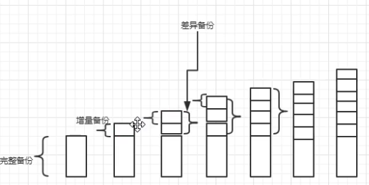

# 数据容灾

《Seeking-SRE》  
* CHAPTER 16: Database Reliability Engineering  
* CHAPTER 17: Engineering for Data Durability


## 主题

1. 原文章节解读及内容扩展 <!-- .element: class="fragment" data-fragment-index="1" --> 
   1. 数据可用性和耐久性介绍
   2. 冗余和备份是数据容灾的基础工作
   3. 作者对提高数据耐久性的建议
2. 项目实践 <!-- .element: class="fragment" data-fragment-index="2" --> 
   1. 小米Mysql容灾实践
   2. Buffalo备份系统-高效的复制协议介绍

Note: 这次分享的主要内容如下: 
第一个部分是 书里的两个章节的内容总结, 主要是一些指导思想, 除了书里的内容以外, 我还搜索了一些资料补充了一些内容
1. 第二个部分内容是小米数据库的容灾方案和大家一起再学习一下, 另外关于buffalo 备份系统的架构及功能的介绍


## 1.1 数据可用性和耐久性介绍


### 数据可用性 vs 数据耐久性

* 数据可用性指的是存储系统是可正常操作，能根据协议提供数据服务 
* 耐久性指的是存储的数据不会遭受位损坏、硬件故障, 删除引发数据丢失

--- 
<font size=5>
对于数据中心和互联网服务来说，可用性是运营的一个关键指标，因为任何一分钟的停机时间影响到用户体验, 对SRE可用性更是一个生命线, 我们往往要想各种办法, 从业务容灾, 流程制度, 监控告警等方面保障可用性

但是数据耐久性的同等甚至更重要。因为数据丢失,可能造成的严重品牌影响, 财务赔偿甚至法律影响. 
</font>
---

Note: Bit-Rot 位衰減: 物理设备老化引起的bit位反转, 数据存储到介质中往往都是电信号(闪存nand)或磁信号(硬盘, 磁带), 甚至是纸带, 都会老化失效

云服务业务多次在做机房搭建, 迁移项目一再对存储团队, 运维团队强调, 我们对用户提供的是存储服务, 上传失败可以通过重试, 用户感知不会特别明显, 但是数据绝对不能丢失, 用户数据丢失可诉量会大量增加, 会带来及其严重的商业影响, 甚至用户对品牌的信任度丢失


### 丢数据事故案例

1.  [Gitlab.com 误删数据，备份恢复失败已宕机 10 小时](https://www.oschina.net/news/81473/gitlab-com-down)
2.  [京都大学超级计算机备份期间丢失 77TB 数据](https://www.oschina.net/news/177207/japan-university-lost-77tb-of-research-data)
3.  [腾讯云给一家创业公司带来的灾难!](https://www.doit.com.cn/p/312087.html)

Note: 
1. 2017年的时候 gitlab 在处理一个邮件攻击的过程时，工程师连续长时间工作, 在操作数据库的时候执行 rm -rf 删了300GB 生产环境数据, 删除错了集群。等到清醒过来紧急按下ctrl + c，只有4.5GB保留下来。 恢复过程发现 sql 备份没启用, S3 备份没有正常工作, 磁盘镜像没有对该集群生效, 最后通过LVM 镜像6小时前的快照恢复了数据,  网站恢复在线的时候已经过去了1天
2. 去年12月, 日本京都大学由于其惠普超级计算机的备份系统出现错误，导致约 77TB 的研究数据被删除, 共计 14 个研究小组的 3400 万份文件从系统和备份文件中被抹去, 看故障描述备份任务是通过脚本执行的, 在备份前还进行日志清理操作, 然后他们在旧备份脚本工作过程中更新了备份脚本, 导致出现了未定义的变量, 最后删除了重要数据
3. 18年, 一个叫 “前沿数控技术” 的公司的事故, 故障出在公有云上, 腾讯云，一个听起来就很牛逼的品牌。其云服务器声称9个9的数据可靠性，号称搭载了云硬盘提供三副本存储策略，也就是说只要把数据放在腾讯云上，只有十亿分之一出现数据丢失的可能性, 腾讯云承认了故障并同意给赔偿, 根据业务的损失估算, 这家公司想腾讯云索赔11016000, 最后腾讯云只赔偿服务器费用, 大概13w   (公告原因: 硬盘故障bug引发数据静默损坏, 运维数据迁移操作不合规, 关闭了数据校验)


## 1.2 冗余和备份是数据容灾的基础工作


### 1.2.1 冗余技术

1. RAID技术(Redundant Array of Independent Disk)  

2. 多副本技术, 比如
   1. mysql同步/异步备份
   2. 分布式数据库中的三副本存储+一致性协议
3. 分布式纠删码(Erasure Coding), 比如公有云对象存储  


Note: 
1. RAID 磁盘阵列是一种冗余技术, 目前用得比较多的是 RAID 5, RAID 10 
raid5 空间利用率高很多, 校验数据分布在阵列中的所有磁盘上，而没有采用专门的校验磁盘, 阵列中有盘故障, 整个磁盘降级, 性能会严重下降, 需要更换新磁盘重建完成才能恢复正常, 后面有增加hotspare 盘的方式增加容错率(功能有磁盘故障自动重建)
[raid计算器](https://www.synology.cn/zh-cn/support/RAID_calculator)
1. 多副本缺点是存储效率低, 恢复效率很高, 有n个副本存储成本增加n倍
2. dropbox存储技术采用了纠删码技术, 将编码的冗余数据存储在多个磁盘上, 跨地理区域的分发储存, 实现更高的耐用性的同时尽可能降低存储开销 
3. 纠删码的核心参数就是 n和m 的比值，这个值称为冗余度，冗余度越高，允许损坏的数据块就越多，也就越安全，同时数据存储的成本也越高。


### 1.2.2 备份技术

备份强大的地方在于逻辑上和物理上与主数据存储分开, 主数据丢失或损坏不会波及到备份数据

理想情况下, 备份应该遵守3-2-1原则

* 至少要有 3 份数据备份
* 将这些备份存放在 2 种不同的存储设备上
* 至少异地备份 1 份


### 恢复

1. 必须进行定期的恢复测试
2. 恢复时间过长, 也是有损的

---
<font size=5>
案例: 从备份恢复状态可能需要出人意料地长的时间，尤其是在最近没有进行过恢复演练。很多案例都可以看到，在需要恢复数据的时候, 发现多重备份都存在问题, 因此如果不按计划进行恢复测试，备份可能根本不起作用！
</font>

---


### freshness -> 去重度

单次备份中是否会上传重复数据
 


Note: 单次备份中的A目录包含icon文件, A目录下B子目录也包含icon文件


### freshness -> 去重度

多次备份中是否会上传重复数据

 

---
<font size=5 color=yellow>
去重度是考验备份工具或协议是否实现良好的一个重要指标, 是否拥有一个强大增量备份的协议直接关系到备份成本和效率
</font>

---


## 1.3 作者对提高数据耐久性的建议


### 计算存储耐久性

Markov模型: 基于分布式纠删码达到目标耐久性需要多少冗余度的计算模型


---
dropBox 做到了24个9的数据耐久性(理论值)   <!-- .element: class="fragment" data-fragment-index="1" --> 

<font color=yellow>
但就算把耐久性做到了天文数字, 就一定可靠了吗?
</font>  <!-- .element: class="fragment" data-fragment-index="2" -->

---


### 哪些是真实的威胁?

1. 极短时间内多个地理区域一组特定6个磁盘同时损坏?  
2. 维护人员误删除了数据 ?
3. 程序bug 导致数据缓慢丢失或损坏?

---
<font color=yellow>
防范2与3这类威胁是SRE 真正的职责
</font>  <!-- .element: class="fragment" data-fragment-index="2" -->

---

Note: 就像前面提到的故障案例, 大部分不是物理的耐久性到了瓶颈, 而是程序, 流程上的问题


### 强有力的隔离是防止问题扩散的关键

1. 物理隔离 - 把鸡蛋放到不同的篮子  
2. 逻辑隔离 - 避免故障在分布式系统中传播
3. 操作隔离 - 完善的发布流程
> 

Note: 
1. 物理隔离的例子
   1. 磁盘做RAID1 , 故障发生了还能正常工作
   2. 业务的主机部署在机房同一个交换机下, 当核心网络设备故障, 业务全部瘫痪
   3. 业务部署单集群, 集群基础设施出现问题, 业务没有自救方案
2. 逻辑隔离的例子
   1. 数据库账号拆分, 不同业务采用独立账号, 避免风险sql扩大影响范围
   2. 多机房配置中心间数据同步, 其中一个配置中心被打挂了,两个配置中心间没有强耦合, 另一个配置中心仍可以正常工作 @硕哥
3. 按照测试, staging环境, 灰度, 全量流程上线, 这些我们都很熟悉


### 最大的可靠性威胁来自工程师

1. 测试 - 通过单元测试, 集成测试, 故障注入提高容错性
2. 保护 - 持续完善防护功能, 避免引发高风险操作
3. 撤销操作 - 对象删除流程(缓冲危险)


Note:  
1. 通过完善的测试, 确保变更内容是符合预期的
2. dropbox 的案例, 工程师执行了sql或脚本引发了灾难性故障,  反思点是不应该责怪操作员。如果一个简单的错误可能导致大规模停机，那就是流程故障，而不是人员故障.

在这样的情况下，有许多明显的保障措施需要实施。比如添加了阻止重新启动实时数据库主机的访问控件 ， 比如更改了分布式shell com-mand的语法，使其不那么容易受到错别字的影响。 
我们在工具中添加了基于隔离的限制，拒绝在多个隔离域同时运行的任何分布式命令。然而，最重要的是，我们在自动化方面进行了大量研究，以免于操作员需要运行这样的脚本，而是依赖于自动化系统

作为一项工程原则，必须保持对保护的需求，以便在初步部署其保护系统的同时开发安全防护罩。
3. 换句话说变更前准备好回滚方案


### 故障检测

无论多么可靠的系统都有可能发生意外, 如何快速发现异常并恢复很重要

dropbox的监控实践
   1. 基础监控: 磁盘S.M.A.R.T检测
   2. 组件监控: 遍历文件索引验证对应数据块是否存在
   3. 黑盒监控: 模拟用户的数据访问行为, 对系统的1%数据块做采样验证
   4. 监控系统的监控

Note: 
在大型复杂系统中，最好的保护通常是检测异常并在异常发生后立即从中恢复的能力


### 自动化 - 减轻工程师压力

1. 自动化往往效率更高
2. 自动化往往更可靠性  
3. 运维人员疲劳, 规则和培训只能起到一时的作用, 良好的自动化是必要的  


Note: 对于RAID阵列, 操作员可能需要几天时间才能出现到现场并替换特定磁盘, 而在自动化系统中, 此数据可能在少数几个小时内自动重新复制
1. 出现坏扇区, 文件系统标记坏扇区, 恢复正常
2. 进一步文件系统故障, 重新格式化文件系统, 恢复正常
3. 检测到磁盘损坏, 重建磁盘


## 小结

建设数据容灾过程冗余和备份只是基础, 还需要与隔离, 保护, 监控和自动化相结合


## 2.1 小米Mysql容灾方案


## 数据冗余

多副本: 双机房一主多从DB


Note:  
* 双机房入口LB + 双机房读写分离DB中间件MiProxy
* 读服务：DB中间件跨机房访问所有可用DB
* 写服务：为单主库，需要跨机房


## 数据备份

备份策略: 

1. 至少3个备份副本, 包含热备, 冷备, 异地备份 ✅ 
2. 至少2种不同的存储设备, 包含Storage存储, 及FDS存储 ✅
3. 至少1处异地备份, 异地备份到其他FDS集群 ✅ 

备份演练
- 每个冷备份集群恢复演练1次/月


## 隔离

 
- DB隔离：单个MySQL实例最好单个业务账号使用，避免多个业务使用同一个账号，写入同一个DB
- 资源隔离：已灰度MySQL套餐模式，物理机资源做了隔离


## 监控&自动化

* 监控: 每一个集群都同时具备Falcon监控&Grafana监控，方便查看各集群状态  
* 自动化: Garm平台  


## 2.2 SRE备份工具的实践 - 高效的复制协议


### 备份系统架构介绍


Note: 用户可以通过web 管理平台和命令行工具使用备份工具, 两种备份工具流程如上图
备份系统是基于开源备份项目restic二次开发的, 备份过程实现了高效的复制协议, 接下来我给大家分享下如何restic 高效的复制协议是如何实现的
和开源项目合并代码


### 去重方案介绍

1. 基于文件hash散列去重, 不上传重复的文件
2. 基于固定大小对文件分片, 每个分片进行hash散列记录, 不上传重复的分片


Note: 
1. 无去重, 备份成本线性增加
2. 进行优化, 记录文件hash散列, 不上传重复文件, 但是如果只修改大文件的一小部分会发生什么？  使用此策略修改后的文件将再次保存，尽管其中大部分没有更改.
3. 如果对文件进行分片, 对分片内容进行hash散列, 不上传重复的分片. 但是当用户在文件的开头添加一个字节时会发生什么？块边界（一个块结束和下一个开始的地方）将移动一个字节，改变文件中的每个块。当备份程序现在将文件拆分为固定大小的块时，它（在大多数情况下）最终会得到一个不同块的列表, 因此它需要将每个块作为一个新块保存到备份位置。这对于现代备份程序来说并不令人满意。


### 内容定义分块CDC算法介绍

如果能根据数据内容的特征来分块的话，如果发生文件内容改变，情况会如下图：


如何找到和定义这些分割点（Anchor）?


* [源码实现: https://github.com/restic/chunker](https://github.com/restic/chunker)  
* [参考: Foundation - Introducing Content Defined Chunking (CDC)](https://restic.net/blog/2015-09-12/restic-foundation1-cdc/)

Note: Restic 的工作方式有点不同。它还对来自文件的数据块进行操作，并且只上传新的块，但使用一种更复杂的方法将文件拆分成块，称为内容定义的块。它的工作原理是根据文件的内容将文件拆分成块，而不是总是在固定数量的字节后拆分。
1. 64B长度文本看作为一个大数, rabin hash 过程完全通过位运算实现, 时间复杂度O(n)
2. 分完块以后每个数据块计算sha256, 如果后续发现重复的数据块就更新索引, 而不是重复上传, 重复数据块的检测使用sha256
3. 云服务的存储去重建议


### 限流实现 - 令牌桶算法

```golang
type Bucket struct {
	startTime time.Time // 记录开始时间
	capacity int64 // 桶容量
	quantum int64 // 每次往桶加多少tokens
	fillInterval time.Duration // 多久添加一次tokens
	availableTokens int64 // 桶里面可用token
	latestTick int64 // 记录最近添加tokens 的时间
}

```

  


[算法实现: https://github.com/juju/ratelimit](https://github.com/juju/ratelimit)

Note: 令牌桶算法是限制网络流量和io 速率的常见算法, 可以用来控制单位时间内平均速率, 并允许一定程度数据突发, 也可以应用到业务限流, 比如服务端限流
这个例子中限流桶包含 reader, writer, bucket, 在做Read() 或 Write() 方法前, 调用bucket对象的Wait 方法计算返回需要等待的时间长度
当前时间Now() - latestTick可以计算出向bucket中添加多少tokens, 请求的数据长度少于桶内已有的token, 本次请求成功, 桶内减去相应长度的token
请求的数据长度大于桶内token, 计算出需要等待多久桶内才能填充足够token, 返回时间长度, 调用程序进行等待


## thanks
