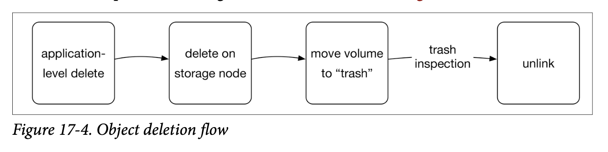

# 数据可靠性

《Seeking-SRE》CHAPTER 17: Engineering for Data Durability

分享人: 刘广路  
时间: 2022-08-18

## 目录

1. 你的网站是否可靠? <!-- .element: class="fragment" data-fragment-index="1" --> 
2. 备份只是基础 <!-- .element: class="fragment" data-fragment-index="2" --> 
   1. 多副本
   2. 可靠的恢复
   3. 通过增量优化备份
3. dropbox的底层存储可靠性实践 <!-- .element: class="fragment" data-fragment-index="3" --> 
4. 提高数据可靠性的建议 <!-- .element: class="fragment" data-fragment-index="4" --> 
   1. 隔离
   2. 保护
   3. 验证
   4. 自动化

## 你的网站是否可靠? 

判断一个网站是否可靠的一个及其重要的标准是  
**数据是否可靠**

丢数据事故案例

1.  [Gitlab.com 误删数据，备份恢复失败已宕机 10 小时](https://www.oschina.net/news/81473/gitlab-com-down)
2.  [京都大学超级计算机备份期间丢失 77TB 数据](https://www.oschina.net/news/177207/japan-university-lost-77tb-of-research-data)
3.  [腾讯云给一家创业公司带来的灾难!](https://www.doit.com.cn/p/312087.html)

Note: 
1. 云服务业务一再对存储团队及公有云强调, 我们对用户提供的是存储服务, 上传失败可以忍受, 但是数据绝对不能丢失, 用户数据丢失会带来及其严重的商业影响, 用户对品牌的信任度丢失
2. 举例子: 2月1日15:30，微博帐号为ruanrf的用户发微博提到“GitLab.com这次麻烦了，数据库维护时，rm -rf 删了300GB 生产环境数据。等到清醒过来紧急按下ctrl + c，只有4.5GB保留下来。然后恢复备份失败，网站已经宕了10个小时，现在还没恢复, 更让人称赞的还有GitLab透明的故障处理过程：在Twitter公开事件进展，在YouTube上直播数据恢复进程，上线后，在官网公布事件始末，没有任何隐瞒，是一次非常成功的公关处理。

## 多副本只是基础

### 多副本

逻辑上和物理上与主数据存储分开, 数据库丢失或损坏不会影响备份  
理想情况下, 数据应该存储在本地和异地都有保存, 可以本地快速恢复, 以及异地恢复

## 恢复

1. 有备份数据和备份能不能恢复成功是两回事  
2. 恢复时间过长, 也是有损的

## freshness (新鲜度)

当前备份相比上次备份的新鲜度, 即上传了多少非重复数据  
这个是考验备份工具或协议是否实现良好的一个重要指标  
是否拥有一个强大增量备份的协议直接决定了备份成本和效率

## 扩展: 备份策略

### 全量冷备

每次备份都是一次完整克隆, 随之而来的备份成本线性增加

### “增量”备份

  
仅保存自上次备份以来发生更改的文件, 这样未修改的文件不会再次存储在后续备份中。 

但是如果只修改大文件的一小部分会发生什么？  
使用此策略修改后的文件将再次保存，尽管其中大部分没有更改.

### 进阶“增量”

将文件拆分成较小的固定大小的块（以下称为“块”），例如1MiB 大小。当备份程序将文件保存到备份位置时，保存所有块和文件组成的块列表就足够了。例如，这些块可以通过内容的 SHA-256 哈希来识别，因此可以检测到重复的块并仅保存一次。这样对于包含大量连续空字节的文件，只需要存储一块空字节

### 更进一步-内容定义分块

但是当用户在文件的开头添加一个字节时会发生什么？块边界（一个块结束和下一个开始的地方）将移动一个字节，改变文件中的每个块。当备份程序现在将文件拆分为固定大小的块时，它（在大多数情况下）最终会得到一个不同块的列表.
因此它需要将每个块作为一个新块保存到备份位置。这对于现代备份程序来说并不令人满意。

[Foundation - Introducing Content Defined Chunking (CDC)](https://restic.net/blog/2015-09-12/restic-foundation1-cdc/)

> buffalo备份系统使用内容定义分块来实现增量逻辑

## 数据耐久性

### 纠删码容错

dropbox存储技术采用了纠删码技术, 将编码的冗余数据存储在多个磁盘上, 跨地理区域的分发储存

实现更高的耐用性的同时尽可能降低存储开销  
参考类似磁盘阵列技术

[raid计算器](https://www.synology.cn/zh-cn/support/RAID_calculator)

### 计算存储耐久性

Markov 模型: 计算存储需要多少个副本的模型

输入:
1. 平均运行多久会坏一个存储单位
2. 恢复一个存储单位平均需要多久
3. 最大可以同时损坏多少个存储单位

dropBox 做到了24个9的数据可靠性(理论值)

就算把数据耐久性做到了天文数字, 就一定可靠了吗?  

### 哪些是真实的威胁?
1. 极短时间内多个地理区域一组特定6个磁盘同事损坏?  ❌
2. 维护人员rm -rf 了数据  ✅
3. 程序bug 导致数据缓慢丢失或损坏  ✅

防范这些威胁是SRE 真正的职责 <!-- .element: class="fragment" data-fragment-index="1" --> 

## 真实世界的耐久性

我们往往可以做一些故障预案防止已知风险发生, 但是故障往往来源于未知事件  
故障总会发生, 可靠的公司总是能在用户受到影响前做出响应和恢复

### 强有力的隔离是防止问题扩散的关键

1. 物理隔离 - 把鸡蛋放到不同的篮子  
> 磁盘, 主机, 机架, 供电系统, 集群, 数据中心等, 都会面临物理故障的风险
1. 逻辑隔离 - 避免故障在分布式系统中传播
2. 操作隔离 - 完善的发布流程
> 

Note: 物理机多机架, 云主机多可用区, 多数据中心

### 最大的可靠性威胁来自工程师

1. 测试 - 通过单元测试, 集成测试, 故障注入提高容错性
2. 保障 - 运维人员操作引发故障
3. 撤销操作 - 对象删除流程(缓冲危险)

Note: 是人的问题还是流程工具的问题, 为什么线上可以轻易运行有风险的指令? 
为什么命令参数容易弄错?  为什么必须脚本操作? 

### 意外是难免的, 所以重点在于故障发现

1. 0的力量 - 对系统的完全信任
2. 监控
   1. 磁盘S.M.A.R.T
   2. 文件索引对应节点验证
   3. 存储监控程序, 采样验证
3. 监控系统的监控

Note: 监控系统停止了却没有报警

### 自动化, 释放精力

> 你没有时间做大量重复工作

1. 自动化往往效率更高
   1. 对于RAID阵列, 操作员可能需要几天时间才能出现到现场并替换特定磁盘, 而在自动化系统中, 此数据可能在少数几个小时内重新复制
2. 运维人员疲劳, 规则和培训只能起到一时的作用, 良好的自动化是必要的
3. 自动化往往更可靠性 - 自动磁盘修复系统

### 小结

备份只是一部分, 需要与隔离, 保护, 监控和自动化机制相结合